

# Git y control de versiones

***Nombre:*** Antonio Navarro Hernández(user1), Jose Manuel Peña Rodríguez(user2).
***Curso:*** 2º de Ciclo Superior de Desarrollo de Aplicaciones Web.

### ÍNDICE

+ [Introducción](#id1)
+ [Objetivos](#id2)
+ [Material empleado](#id3)
+ [Desarrollo](#id4)
+ [Conclusiones](#id5)

#### ***Introducción***. 

En esta tarea se nos propone trabajar con git y control de versiones. Para ello relizamos tanto trabajo por terminal como la utilización de la interfáz gráfica de github.

#### ***Objetivos***. 

El objetivo es crear issues en un archivo que trabajamos en conjunto crear colisiones e issues en un archivo css para resolverlas con el fin de completar el trabajo.

#### ***Material empleado***. 

Respecto al Hardware usamos nuestros PCs, los asignados en clase pero también usamos los que tenemos en casa. En la parte de software usamos Github para el control de versiones, distintos tipos de terminales (CMD, bash) y el IDE visual Studio Code.  

#### ***Desarrollo***. 

*user1* crea un repositorio público llamado git-work en su cuenta de GitHub, añadiendo un README.md y una licencia MIT.

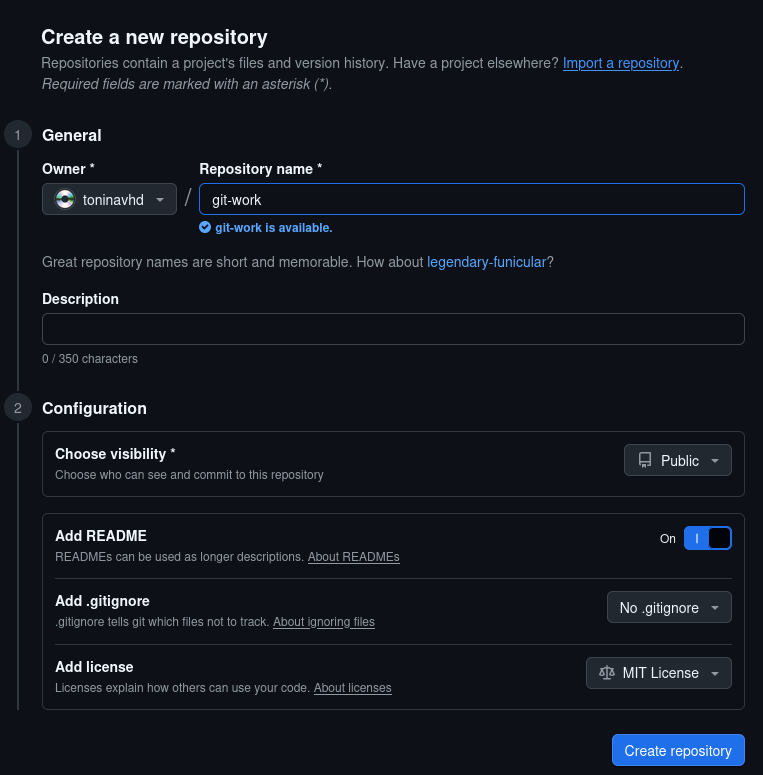

*user1* clonará el repo y añadirá los ficheros: index.html, bootstrap.min.css y cover.css. Luego subirá los cambios al upstream.

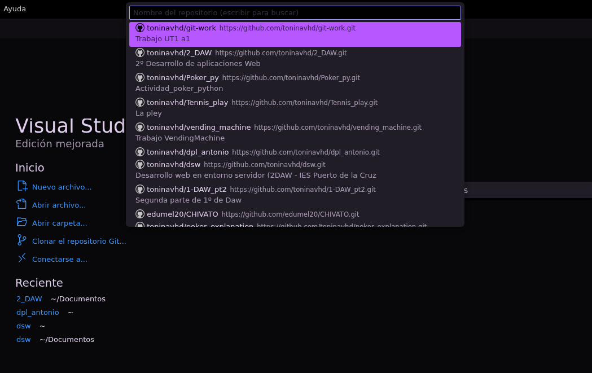

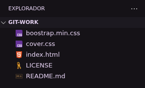

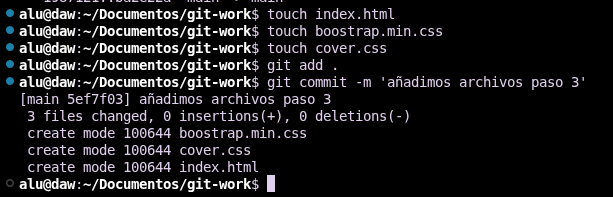

*user2* crea un fork de git-work desde su cuenta de GitHub.

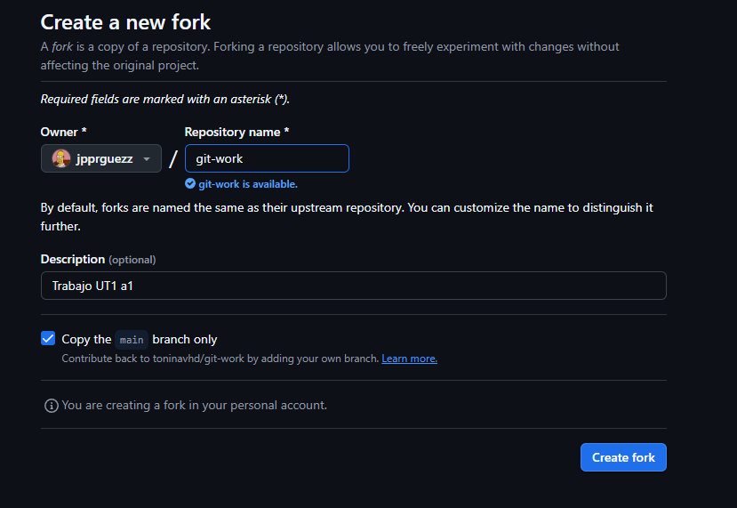

*user2* clonará su fork del repo.

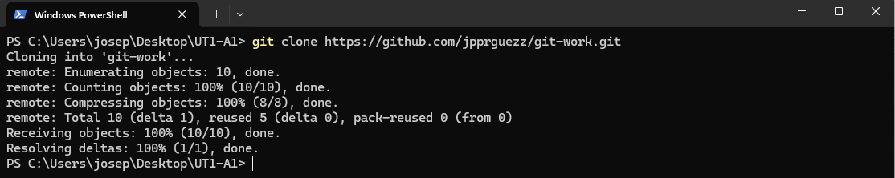

*user1* creará una issue con el título "Add custom text for startup contents".

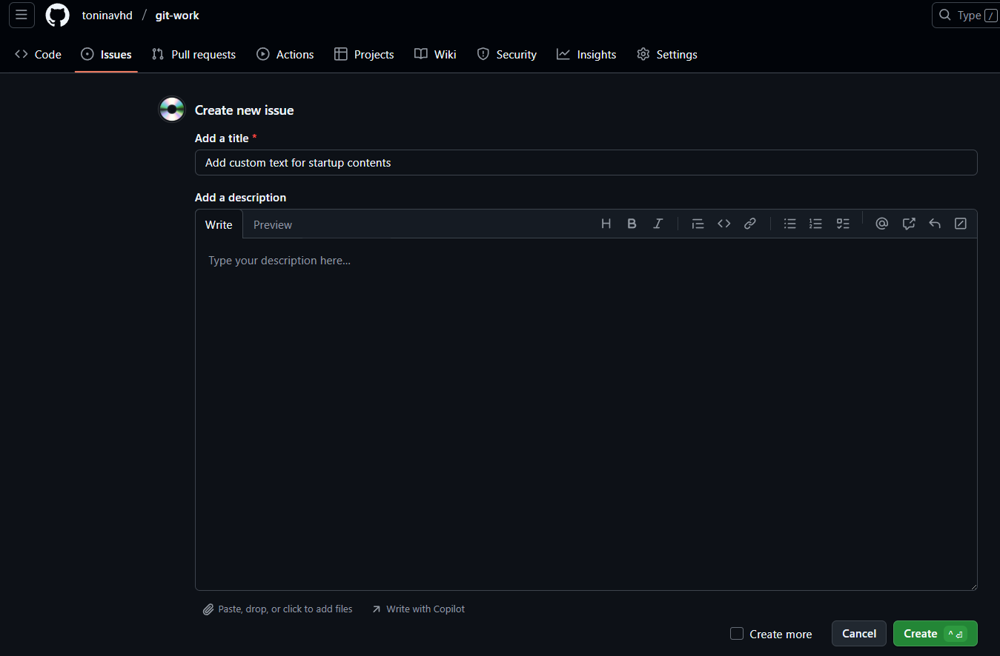

*user2* creará una nueva rama custom-text y modificará el fichero index.html personalizándolo para una supuesta startup.

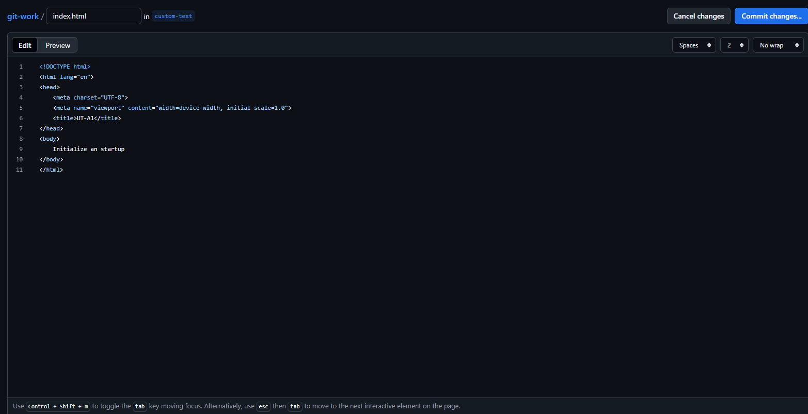

*user2* enviará un PR (Pull Request) a user1.

*user1* probará el PR de user2 en su máquina (copia local) creando previamente un remoto denominado upstream, y realizará ciertos cambios en su copia local que luego deberá subir al propio PR.

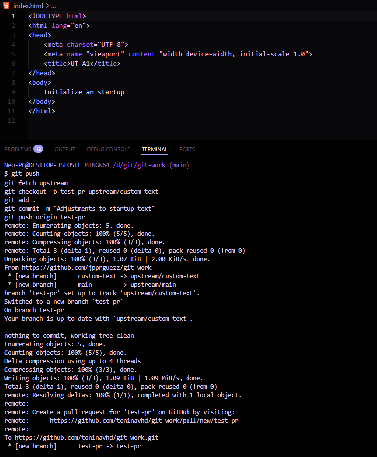

*user1* y *user2* tendrán una pequeña conversación en la página del PR, donde cada usuario incluirá, al menos, un cambio más.

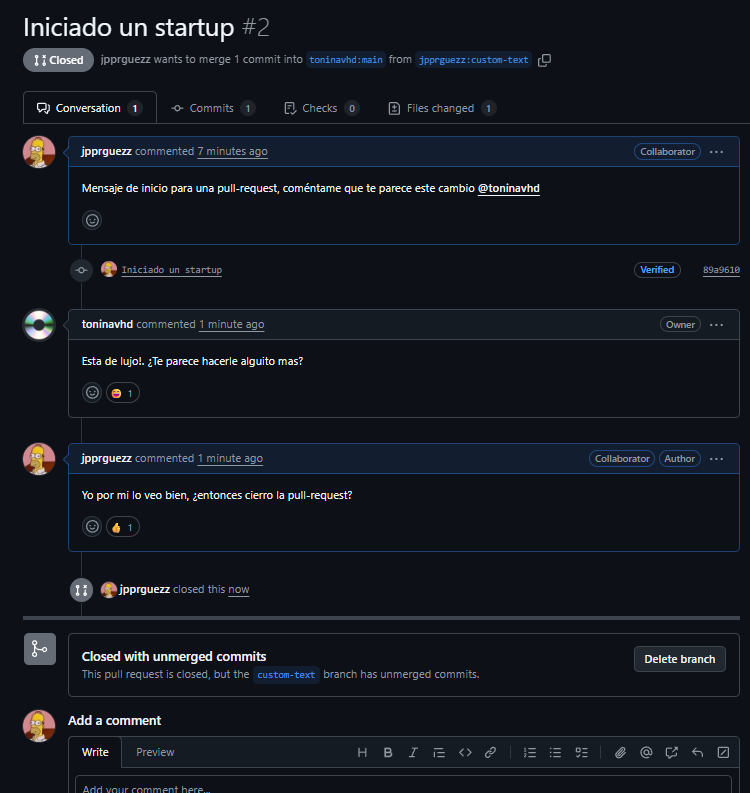

*user1* finalmente aprobará el PR, cerrará la issue creada (usando una referencia a la misma) y actualizará la rama principal en su copia local.

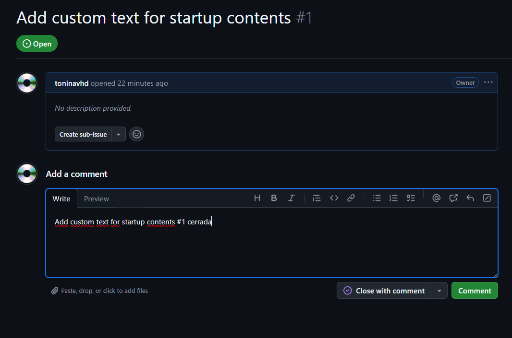

*user2* deberá incorporar los cambios de la rama principal de upstream en su propia rama principal.

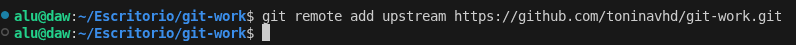

*user1* creará una issue con el título "Improve UX with cool colors".

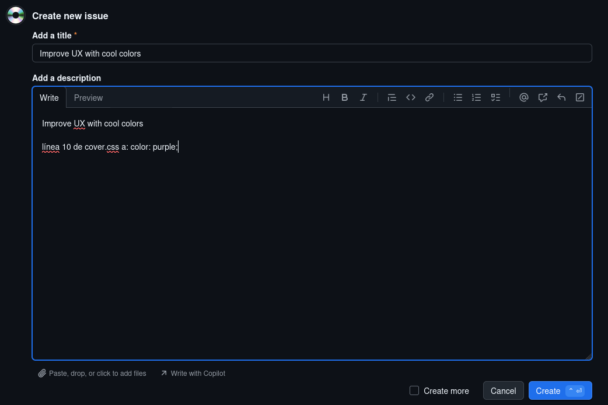

*user1* cambiará la línea 10 de cover.css a: color: purple;

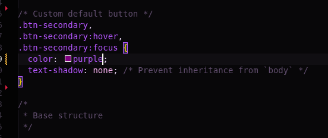

*user1* hará simplemente un commit local en main → NO HACER git push.

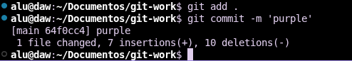

*user2* creará una nueva rama cool-colors y cambiará la línea 10 de cover.css a: color: darkgreen;

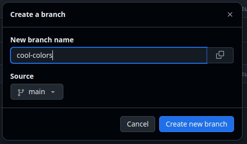

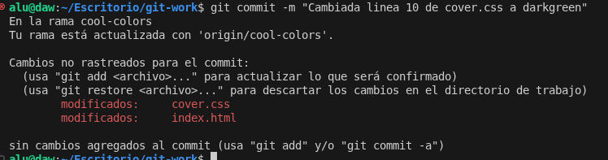

*user2* enviará un PR a *user1*

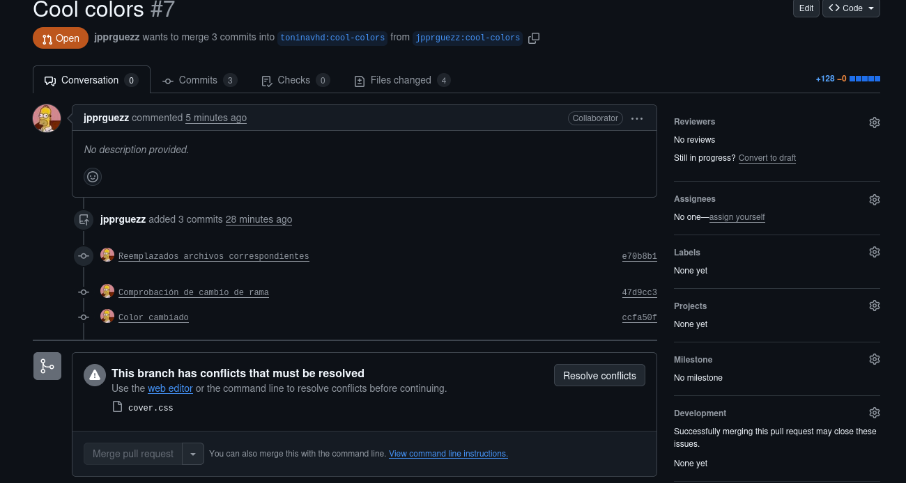

*user1* probará el PR de *user2* (en su copia local). A continuación tratará de mergear el contenido de la rama cool-colors en su rama principal y tendrá que gestionar el conflicto: Dejar el contenido que viene de user2.

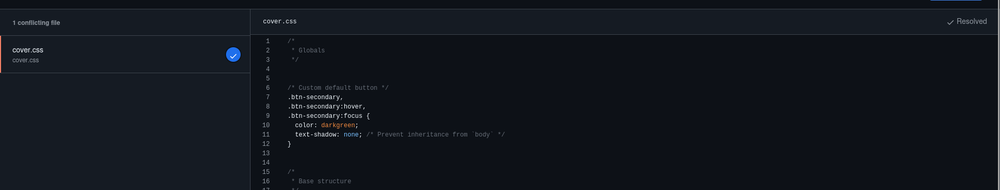

Después del commit para arreglar el conflicto, *user1* modificará la línea 11 de cover.css a: text-shadow: 2px 2px 8px lightgreen;

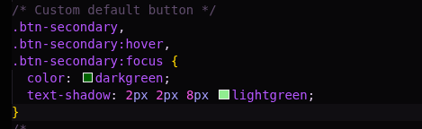

*user1* hará un commit especificando en el mensaje de commit el cambio hecho (sombra) y que se cierra la issue creada (usar referencia a la issue). A continuación subirá los cambios a origin/main.

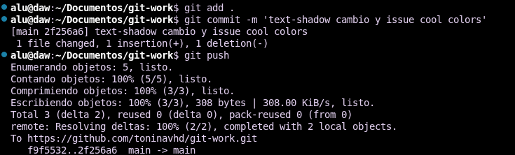

*user1* etiquetará esta versión (en su copia local) como 0.1.0 y después de subir los cambios creará una "release" en GitHub apuntando a esta etiqueta.

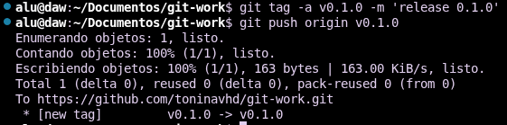

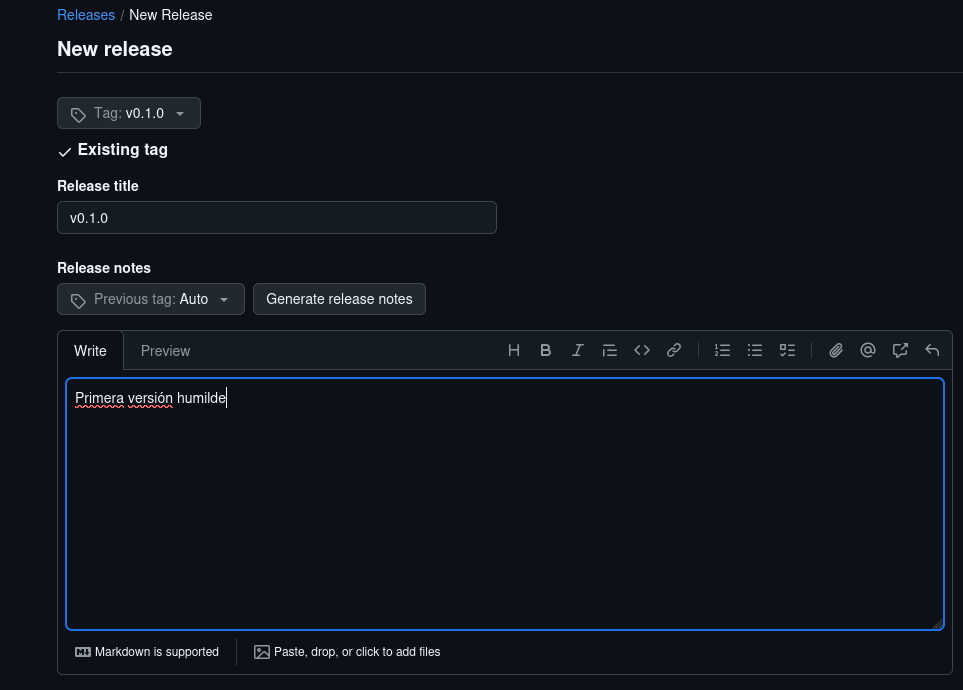

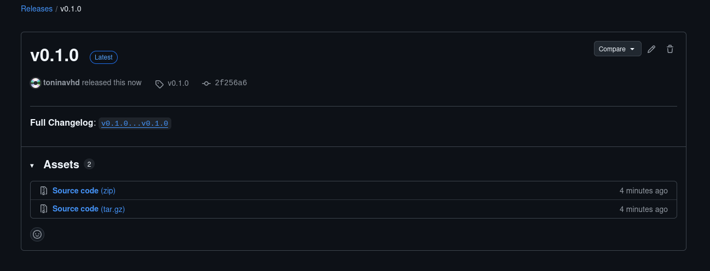

#### ***Conclusiones***. 

 El uso de git y github facilita muchísimo las tareas a distancia (en remoto) y es una herramienta importante en el campo de la informática a la hora de hacer código en un equipo de trabajo. 
 
 A nuestro parecer es importante aprenderlo para que, a la hora de entrar en una empresa y trabajar con mas gente, podamos manejarnos para no hacer perder tiempo al equipo.
